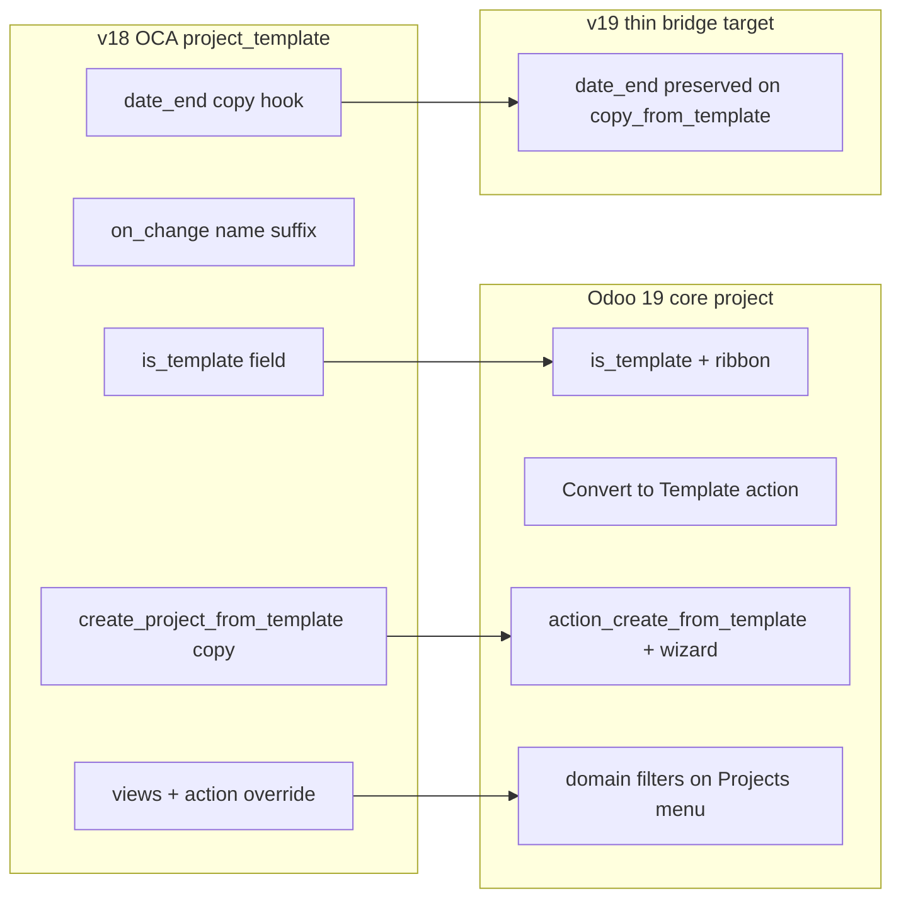

# Project Template v19 Migration Review

## Executive summary

The current v19 `project_template` module is **not v19-aligned**. It is essentially the v18 OCA module with a version bump and two superficial edits (`view_type` added — incorrectly — and kanban inherit dropped). **Odoo 19 core `project` already ships native templates**, so most of this module duplicates or **regresses** core behavior.

**Chosen strategy (per your selection): thin bridge module** — rely on core for templates; keep only behavior core does not provide.



---

## v18 vs v19 current state

| Area | v18 OCA `project_template` | v19 current | v19 core `project` |
|------|------|-------------|-------------------|
| `is_template` | OCA redeclares field | Same redeclaration | Native field on `project.project` |
| Mark as template | Checkbox + `on_change` appends ` (TEMPLATE)`, clears PM/customer/alias | Same | Gear **Convert to Template** + template ribbon |
| Create from template | `create_project_from_template()` → raw `copy()` + open form | Same + deprecated `view_type` | `action_create_from_template()` + wizard (`project_template_create_wizard`) |
| Kanban entry | Menu link under `card_menu_view` | **Removed** (incomplete) | Templates via **Projects → New** template picker |
| Search filters | Extra Templates / Non-Templates filters | Same (duplicate) | Native **Templates** filter + `render_project_templates` context |
| Projects menu domain | Overridden via `search_default_projects` | Same override | Hard `domain=[("is_template","=",False)]` on `open_view_project_all` |
| Task `date_end` on copy | Preserved via custom context key | Same logic | **Not preserved** (`date_end` is `copy=False`; `update_date_end` clears on stage copy) |

---

## Issues in current v19 (must fix)

### 1. Regression: action window override (critical)

`project_template/views/project.xml` overrides `project.open_view_project_all` context with `search_default_projects: True` but **does not keep** core’s domain filter.

Core (Odoo 19):

In `addons/project/views/project_project_views.xml` (`open_view_project_all`):

```xml
<field name="domain">[("is_template", "=", False)]</field>
<field name="context">{'display_milestone_deadline': True}</field>
```

OCA override **replaces** context and weakens isolation — templates can appear in the main Projects list if the user clears the search filter.

**Fix:** Remove the `open_view_project_all` record entirely.

### 2. Duplicate / conflicting UI (remove)

- Form inherit: redundant **Is Template?** checkbox (core uses Convert to Template + ribbon).
- Form button **Create Project From Template** (core uses wizard / New-project flow).
- Search inherit: duplicate **Templates** / **Non-Templates** filters (core already has `name="templates"`).

**Fix:** Remove `project_template/views/project.xml` from manifest `data` (or delete file). No replacement views needed.

### 3. Deprecated / wrong Python API (remove or replace)

`project_template/models/project.py`:

- **`is_template` redeclaration** — pointless; core owns the field.
- **`on_change_is_template`** — conflicts with core naming and field clearing semantics.
- **`create_project_from_template`** — bypasses core `copy_from_template` context, role mapping, date shifting, and wizard UX.
- **`view_type: "form"`** — removed in modern Odoo act_window dicts.

**Fix:** Delete `models/project.py` and its import in `project_template/models/__init__.py`. No downstream code outside this module calls `create_project_from_template`.

### 4. Keep and realign: task `date_end` bridge (only additive value)

`project_template/models/project_task.py` logic is still valid but must hook **core’s** copy path:

- Replace custom `TASK_DEFAULT_COPY_CONTEXT_KEY` with `self.env.context.get("copy_from_template")`.
- In `copy_data`: when `copy_from_template`, set `vals["date_end"] = task.date_end`.
- In `update_date_end`: when `copy_from_template`, return `{}` to avoid stage-copy wiping preserved dates.

Core sets `copy_from_template=True` in `action_create_from_template()` (`addons/project/models/project_project.py`, ~L1446); task copy runs via `map_tasks()` with `copy_project=True` — verify both contexts during implementation; extend the guard if `copy_project` is also needed for the `update_date_end` short-circuit.

### 5. Tests: rewrite for v19 workflows

Current tests in `project_template/tests/test_project_template.py` exercise removed APIs (`on_change_is_template`, `create_project_from_template`).

**Replace with:**

- Base: `TestProjectCommon` (same as core `addons/project/tests/test_project_template.py`).
- `test_create_from_template_preserves_task_date_end` — template with tasks having distinct `date_end` values → `action_create_from_template()` → assert dates copied.
- `test_regular_copy_clears_task_date_end` — plain `project.copy()` still clears `date_end` (regression guard).
- Drop name-suffix and non-standard COPY naming tests (OCA-specific; not core behavior).

Wire tests via manifest if not already (`'installable': True` + ensure `tests` package loads on `--test-enable`).

### 6. Manifest / metadata

`project_template/__manifest__.py`:

- Bump to **`19.0.2.0.0`** (behavioral change vs current `19.0.1.0.0`).
- Update `summary` to describe bridge role, e.g. *"Preserves task ending dates when creating projects from templates (extends Odoo 19 core templates)."*
- Remove `data` entry if views file deleted.
- Optional: set `development_status` to `Mature` or add README note that UI moved to core.

---

## User workflow after migration

| v18 OCA habit | v19 core equivalent |
|---------------|---------------------|
| Check **Is Template?** on project form | Project form → gear → **Convert to Template** |
| Filter **Templates** in search | **Projects** search → **Templates** filter (or dedicated template views) |
| Kanban ⋮ → **Create Project from Template** | **Projects → New** → pick template → wizard **Create project** |
| Names ending in ` (TEMPLATE)` | Core keeps original name + **Template** ribbon (optional DB cleanup of legacy suffixes) |

Document this for rollout; no code required unless you want a one-off SQL/script to strip ` (TEMPLATE)` from names post-upgrade.

---

## Verification checklist

1. **Install/upgrade** `project_template` on Odoo 19 with `-i project_template` or `-u project_template --stop-after-init`.
2. **Projects menu** — templates must **not** appear in default list (core domain intact).
3. **Convert to Template** on a project with tasks that have `date_end` set.
4. **Create project from template** via core wizard — new project tasks retain `date_end`; template unchanged.
5. **Regular duplicate** (`copy` on template) — `date_end` still cleared on new tasks.
6. **Run module tests** with `--test-enable -d <db> --test-tags /project_template`.
7. **pre-commit** on changed `.py` files if the repo uses it.

---

## Files to change (expected diff)

| File | Action |
|------|--------|
| `project_template/models/project.py` | Delete |
| `project_template/models/__init__.py` | Import only `project_task` |
| `project_template/models/project_task.py` | Use `copy_from_template` context |
| `project_template/views/project.xml` | Delete or empty; remove from manifest |
| `project_template/tests/test_project_template.py` | Rewrite for core APIs |
| `project_template/__manifest__.py` | Version bump, summary, drop data |

No i18n regeneration required for removed UI strings (optional cleanup later).

---

## Reference

- OCA migration discussion: [OCA/project PR #1617](https://github.com/OCA/project/pull/1617) (same conflicts identified).
- Odoo 19 user docs: [Project templates](https://www.odoo.com/documentation/19.0/applications/services/project/project_management/project_templates.html).
